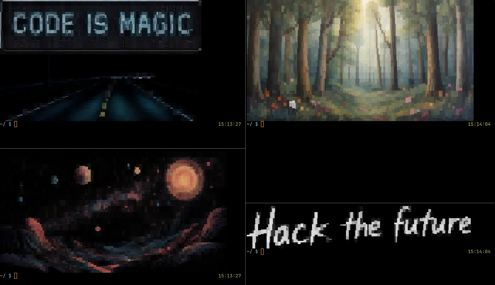

# Frieze

Frieze is a (mostly silly) shell tool for generating and displaying AI-generated banner images and slogans in your terminal.

## Screenshot



## Setup

### Prerequisites

- ImageMagick (`magick` or `convert` command)
- jq
- curl
- tiv (TerminalImageViewer for displaying images)
- Depending on which backing APIs are used, API keys. For example, a (free) [Imagerouter](https://imagerouter.com/) API account and a (free) [Mistral](https://mistral.ai/) API account are needed to use the included `imagerouter.sh` and `mistral.sh` scripts.

If the script is run and a dependency is missing, an error message will be printed indicating which command is not found and how to get it.

### Configuration

The repository includes a `config.env` file with sensible defaults. By default Frieze stores images under `~/.frieze` and expects a credentials file at `~/.frieze/.env` (the `KEY_FILE` configured in `config.env`).

Create the folder and the credentials file (or set `IMAGE_FOLDER` / `KEY_FILE` in `config.env` to your preference):

```env
IMAGEROUTER_KEY=<your imagerouter key>
MISTRAL_API_KEY=<your mistral api key>
```

Note: the exact variable names required depend on which helper script you choose for `IMAGE_SCRIPT` / `TEXT_SCRIPT` — check the chosen script for the key names it expects.

## Usage

Run `frieze.sh` with one of the following commands from the repository root (or install/copy the script into your PATH):

- Generate a new banner image (returns immediately and continues generation in the background):

```sh
./frieze.sh generate
```

The generated image is saved into the configured `IMAGE_FOLDER` (default `~/.frieze`) and a symlink `latest.png` points to the most recent image. Generation runs asynchronously, and progress / debug information is logged to `/tmp/frieze.log`.

- Display the latest banner image in the terminal:

```sh
./frieze.sh display
```

- Display in high resolution (WezTerm only):

```sh
./frieze.sh display high
```

If your terminal does not support direct image display, Frieze falls back to `tiv` (TerminalImageViewer). If `tiv` is missing the script will print installation instructions.

- Display a specific image file:

```sh
./frieze.sh display low path/to/image.png
```

- Show configuration and image stats:

```sh
./frieze.sh info
```

You can call `./frieze.sh generate` or `./frieze.sh display` from your `.zshrc` / `.bashrc` to generate and/or show a new banner each time a shell starts. Because `generate` runs in the background, it won't slow shell startup.

## Customizing the backing APIs

Frieze is modular: text generation and image generation are delegated to small helper scripts. The defaults in `config.env` point to `pollinations.sh` (image) and `hardcoded.sh` (text). Other example scripts included in this repo are `imagerouter.sh`, `cloudflare.sh`, and `mistral.sh`.

To change providers, create a script that exposes the same helper functions used by the main `frieze.sh` driver (see existing scripts for examples) and then set `IMAGE_SCRIPT` or `TEXT_SCRIPT` in `config.env`.

## Notes

- The `generate` command may pick an existing `design_*.png` if the image API fails or rate limits.

## License

Permission is hereby granted, free of charge, to any person obtaining a copy of this software and associated documentation files (the "Software"), to deal in the Software without restriction, including without limitation the rights to use, copy, modify, merge, publish, distribute, sublicense, and/or sell copies of the Software, and to permit persons to whom the Software is furnished to do so, subject to the following conditions:

The above copyright notice and this permission notice shall be included in all copies or substantial portions of the Software.

The Software shall be used for Good, not Evil.

THE SOFTWARE IS PROVIDED "AS IS", WITHOUT WARRANTY OF ANY KIND, EXPRESS OR IMPLIED, INCLUDING BUT NOT LIMITED TO THE WARRANTIES OF MERCHANTABILITY, FITNESS FOR A PARTICULAR PURPOSE AND NONINFRINGEMENT. IN NO EVENT SHALL THE AUTHORS OR COPYRIGHT HOLDERS BE LIABLE FOR ANY CLAIM, DAMAGES OR OTHER LIABILITY, WHETHER IN AN ACTION OF CONTRACT, TORT OR OTHERWISE, ARISING FROM, OUT OF OR IN CONNECTION WITH THE SOFTWARE OR THE USE OR OTHER DEALINGS IN THE SOFTWARE.

(The [JSON License](https://www.json.org/license.html))
